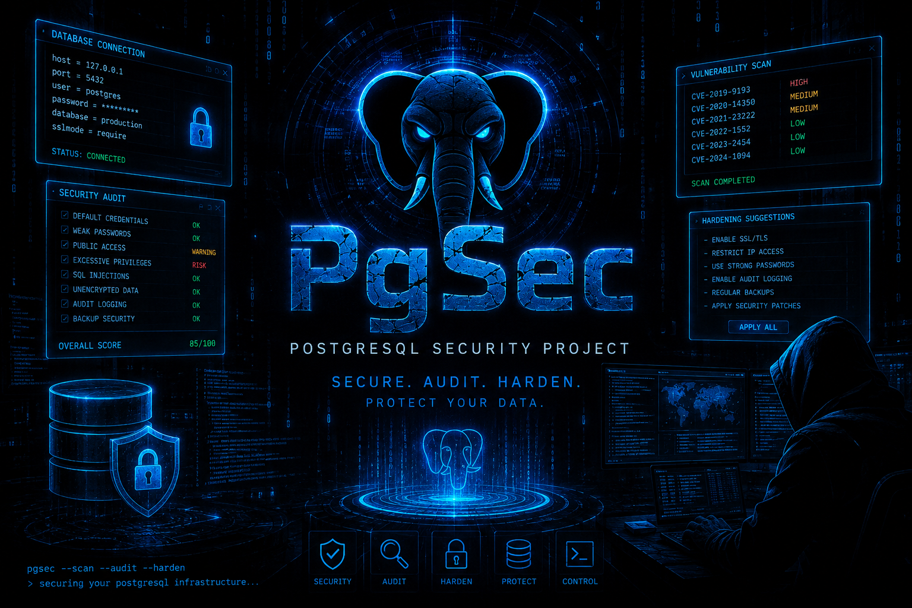

# PostgreSQL Security Assessment Engine v1.1.2

<p align="center">
  
</p>


Production-oriented PostgreSQL 16 security assessment utility based on the CIS PostgreSQL 16 Benchmark v1.1.0, with a separately labeled Enhanced Security Assessment (ESA).

## Execution targets

- Local Linux host
- Local Docker/Podman container
- Remote Linux host over SSH
- Remote Docker/Podman container through SSH + runtime exec
- Single IP/hostname, CIDR, or IP-list file
- SSH password (stdin), SSH private key, strict known-host verification / optional TOFU

## Assessment outputs

- Discovery
- 71 CIS PostgreSQL 16 v1.1.0 controls
- 18 Enhanced Security Assessment (ESA) checks
- Live terminal status stream
- JSON
- XLSX sheets: `Summary`, `Discovery`, `CIS`, `ESA`, `Evidence`

The CIS sheet keeps the six audit columns `Status`, `Name`, `Description`, `Test Result`, `Solution`, and `Security Comments`, then adds `Required Customer Input`, `Customer Response / Evidence`, and `Auditor Decision`; `Target` remains last for multi-host correlation. The ESA sheet keeps the six audit columns plus `Target`.

## Offline use

The `PGSEC_OFFLINE_LINUX_X86_64_PRODUCTION_v1.1.2.zip` distribution contains its own Python runtime and native SSH helper. Download it from the [v1.1.2 release](https://github.com/Royal-Tools/PgSec/releases/download/v1.1.2/PGSEC_OFFLINE_LINUX_X86_64_PRODUCTION_v1.1.2.zip). If your unzip tool drops executable bits, run `chmod -R +x pg-sec-audit runtime/bin bin` after extracting. It does not require `pip install`, an installed Python interpreter, internet access, or package-manager access on the target host. The Linux x86_64 bundle targets **glibc 2.17+** (RHEL/CentOS/Rocky 7+, RHEL 8 / glibc 2.28, Ubuntu 18.04+) and must not be built by copying `/usr/bin/python3.13` from Ubuntu 22.04+.

Build inputs are fetched automatically: `scripts/build_offline.sh` downloads the portable CPython runtime archive when it is not present locally, so no large binaries are stored in this repository.

## Source execution

```bash
python3 pg-sec-audit.py
python3 pg-sec-audit.py --local --mode all --no-network --non-interactive --output-dir reports
```

## Remote examples

```bash
python3 pg-sec-audit.py --ip 10.0.0.10 -u audit -k ~/.ssh/id_ed25519 --all-postgres-containers --mode all --no-network --non-interactive --output-dir reports

printf '%s\n' "$SSH_PASSWORD" | python3 pg-sec-audit.py --file hosts.txt -u audit --password-stdin --all-postgres-containers --mode all --no-network --non-interactive --output-dir reports
```

## Security design

- Password authentication secrets are not placed on command-line arguments.
- SSH unknown host keys are rejected by default.
- `--accept-new-hostkey` explicitly enables trust-on-first-use for unknown keys.
- Container secret-like environment variable **values are never collected**; only variable names are recorded.
- Evidence/report content is redacted for password/token-like values.
- Output files are written with restrictive permissions when the platform permits it.
- CIS recommendations are automated to PASS/FAIL/N/A wherever a deterministic technical decision is supported. `REVIEW` is retained only for genuinely organization-specific authorization/business-policy decisions; `--policy` resolves those automatically where possible.
- PostgreSQL 16 patch intelligence uses one short official request when allowed, then silently falls back to cached/bundled `16.15` if unavailable.

## CIS source

The CIS PDF is deliberately not redistributed. The assessment implementation targets **CIS PostgreSQL 16 Benchmark v1.1.0 (2025-06-30)**. Use your authorized CIS copy when reviewing assessment semantics and remediation.

## v1.1.2 review workflow and automation notes

- CIS PostgreSQL 16 is no longer silently scored against PostgreSQL 17/18. On a non-16 server, CIS16 rows are marked `N/A`; Discovery and ESA can still run. `--force-cis-major-mismatch` is available only for compatibility diagnostics and is not an official CIS16 score.
- Manual CIS controls are automated wherever the benchmark exposes a deterministic technical test. Organization-specific controls can be resolved with `--policy config/policy.example.json` (active login roles, DML grants, RLS-required tables, superusers, syslog facility, extensions/plugins, backup/restore thresholds).
- `WARN` is reserved for future risk-severity use. Current deterministic ESA findings are `PASS`/`FAIL`/`N/A`/`ERROR`; `REVIEW` remains only when a business-policy decision cannot safely be inferred.
- Excel output keeps these columns first on CIS and ESA sheets: `Status`, `Name`, `Description`, `Test Result`, `Solution`, `Security Comments`; `Target` is last. Each worksheet has a title row, frozen header, filters, wrapped text, fixed audit-friendly widths, and status highlighting.

### REVIEW evidence contract

Every CIS `REVIEW` result is actionable: the Excel `Required Customer Input` column states the exact Evidence/Policy/Business input the customer/employer must provide, while `Security Comments` remains reserved for security analysis/risk context. The adjacent `Customer Response / Evidence` column is blank for the customer's answer and `Auditor Decision` is blank for the final disposition. JSON carries the same request in `required_input`. Providing the corresponding policy values converts supported organization-specific cases to deterministic PASS/FAIL.


## CIS REVIEW workflow in Excel

The CIS worksheet contains three dedicated workflow columns after the six audit columns:

- **Required Customer Input** — populated only for REVIEW results and states the exact Evidence/Policy/Business input needed from the customer/employer.
- **Customer Response / Evidence** — intentionally blank for the auditor/customer to record the response, ticket/reference, policy text, or evidence supplied.
- **Auditor Decision** — intentionally blank and includes an Excel dropdown for the final disposition after reviewing the response.

The Summary worksheet includes a CIS-vs-ESA status distribution chart. No CIS recommendation is removed: the catalog remains exactly 71 controls.
